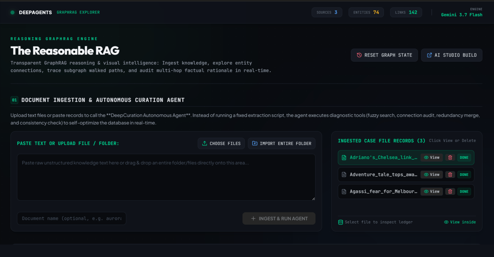
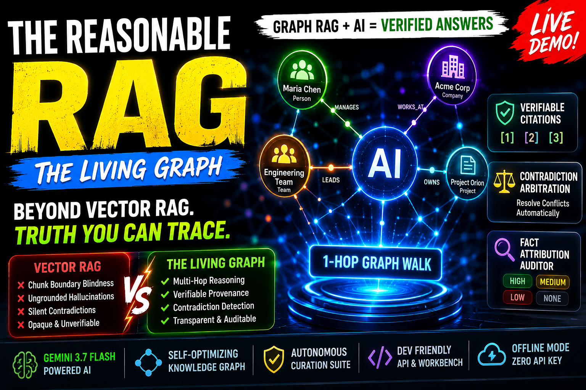

# The Reasonable RAG (The Living Graph)

<div align="center">

```
  ████████╗██╗  ██╗███████╗    ██╗     ██╗██╗   ██╗██╗███╗   ██╗ ██████╗ 
  ╚══██╔══╝██║  ██║██╔════╝    ██║     ██║██║   ██║██║████╗  ██║██╔════╝ 
     ██║   ███████║█████╗      ██║     ██║██║   ██║██║██╔██╗ ██║██║  ███╗
     ██║   ██╔══██║██╔══╝      ██║     ██║╚██╗ ██╔╝██║██║╚██╗██║██║   ██║
     ██║   ██║  ██║███████╗    ███████╗██║ ╚████╔╝ ██║██║ ╚████║╚██████╔╝
     ╚═╝   ╚═╝  ╚═╝╚══════╝    ╚══════╝╚═╝  ╚═══╝  ╚═╝╚═╝  ╚═══╝ ╚═════╝ 
```

**An autonomous, self-optimizing Knowledge Graph RAG platform with multi-hop reasoning, verifiable provenance citations, real-time contradiction arbitration, and fact-attribution auditing.**

The Living Graph is an auditable Knowledge GraphRAG system designed to eliminate AI hallucinations by grounding retrieval in deterministic knowledge networks. Instead of relying on opaque vector similarities, it ingests multi-format documents (PDF, CSV, JSON, Markdown), dynamically extracts semantic entities and typed relationships, and builds an interactive 3D knowledge graph with continuous background curation. When queried, it conducts multi-hop graph traversals, performs TF-IDF context reranking, and synthesizes verifiable answers with clickable citation badges. Every factual claim is directly traceable back to source text chunks, providing full lineage auditing, confidence scoring, and transparent reasoning.

[](https://www.typescriptlang.org/)
[](https://react.dev/)
[](https://vitejs.dev/)
[](https://tailwindcss.com/)
[](https://d3js.org/)
[](https://deepmind.google/technologies/gemini/)
[](LICENSE)

</div>

---
<p align="center">

  

</p>


## Video demo

Watch the full demo on YouTube: [https://youtu.be/pw9BETbNjt0](https://youtu.be/pw9BETbNjt0)

[](https://youtu.be/pw9BETbNjt0)

## 📖 Table of Contents

1. [Executive Overview & Why GraphRAG?](#-executive-overview--why-graphrag)
2. [Vector RAG vs. The Living Graph](#-vector-rag-vs-the-living-graph)
3. [System Architecture & Data Flows](#-system-architecture--data-flows)
4. [Key Capabilities & Modules](#-key-capabilities--modules)
5. [Directory Structure](#-directory-structure)
6. [Interactive Workbench Tour](#-interactive-workbench-tour)
7. [Mathematical Formulations & Traversal Logic](#-mathematical-formulations--traversal-logic)
8. [Multi-Modal Ingestion Pipeline](#-multi-modal-ingestion-pipeline)
9. [Autonomous Curation Tool Suite](#-autonomous-curation-tool-suite)
10. [REST API Reference](#-rest-api-reference)
11. [Quickstart & Installation](#-quickstart--installation)
12. [Offline Mode & Zero-API-Key Resilience](#-offline-mode--zero-api-key-resilience)
13. [License](#-license)

---

## 🌟 Executive Overview & Why GraphRAG?

Traditional **Vector RAG** systems vectorize unstructured text chunks into high-dimensional vector databases and perform nearest-neighbor cosine lookups. While effective for simple surface-level semantic lookups, traditional Vector RAG exhibits three fatal flaws in production:

1. **Chunk-Boundary Blindness**: Complex multi-hop queries (e.g. *"Which models are maintained by teams reporting to Maria Chen?"*) fail when relevant facts are partitioned across separate paragraphs, pages, or files.
2. **Ungrounded Hallucinations**: Standard LLM generation provides no verifiable line-of-sight back to explicit factual claims, leaving users uncertain if answers are grounded or fabricated.
3. **Silent Contradictions**: When newer documents contradict older documentation (e.g., leadership changes or deprecated tech stacks), vector search returns both contradictory chunks, forcing the LLM to guess.

**The Living Graph (Reasonable RAG)** solves this by coupling vector retrieval with a **self-optimizing, auditable Knowledge Graph**:
- Every entity and relationship is tied to its originating text chunk (`chunkId`).
- Queries execute a **1-hop graph walk** seeded by hybrid TF-IDF + keyword vectorization.
- Responses cite strict bracketed IDs (`[1]`, `[2]`), and a dedicated **Fact Attribution Auditor** scores the contribution level of every retrieved claim (`high`, `medium`, `low`, `none`).
- Contradictory claims trigger an **Automated Integrity Scanner** and route disputes to a human-in-the-loop arbitration queue.

---

## ⚖️ Vector RAG vs. The Living Graph

| Feature | Standard Vector RAG | The Living Graph (GraphRAG) |
|---|---|---|
| **Data Representation** | Unstructured text embedding vectors | Structured Entity-Predicate-Object Knowledge Graph + Chunk Provenance |
| **Multi-Hop Traversal** | ❌ Fails on facts separated across chunks | ✅ Follows 1-hop and multi-hop relationship edges across documents |
| **Citation Granularity** | ⚠️ Vague document/chunk-level reference | ✅ Exact relationship triple level with inline `[1]`, `[2]` bracket citations |
| **Attribution Auditing** | ❌ None (Opaque generation) | ✅ Automated 4-tier fact contribution rating (`high`, `medium`, `low`, `none`) |
| **Entity Deduplication** | ❌ Duplicate entities treated as distinct chunks | ✅ Autonomous agent merges canonical entities and remaps edges |
| **Contradiction Handling** | ❌ Mixed contradictory chunks fed to LLM | ✅ Structural dispute detection + Human-in-the-loop arbitration queue |
| **Offline / No API Key** | ❌ Completely broken without embedding model | ✅ 100% functional with deterministic heuristic extraction & local TF-IDF |
| **Visualization** | ❌ High-dimensional vector space is opaque | ✅ Interactive D3.js force-directed physics canvas with glowing seeds |

---

## 🏛️ System Architecture & Data Flows

### High-Level Architecture
```
┌─────────────────────────────────────────────────────────────────────────────┐
│                             CLIENT LAYER (React 18)                         │
│  ┌───────────────┐ ┌───────────────┐ ┌───────────────┐ ┌─────────────────┐  │
│  │ D3.js Physics │ │ Ingestion     │ │ Query / Path  │ │ Conflict / Audit│  │
│  │ Force Graph   │ │ Terminal      │ │ Workbench     │ │ Dashboard       │  │
│  └───────┬───────┘ └───────┬───────┘ └───────┬───────┘ └────────┬────────┘  │
└──────────┼─────────────────┼─────────────────┼──────────────────┼───────────┘
           │                 │ REST API Calls  │                  │
┌──────────┼─────────────────┼─────────────────┼──────────────────┼───────────┐
│          ▼                 ▼                 ▼                  ▼           │
│                             SERVER LAYER (Express)                          │
│  ┌─────────────────┐ ┌─────────────────┐ ┌─────────────────┐ ┌───────────┐  │
│  │   Parsers &     │ │ Extraction &    │ │   GraphRAG &    │ │ Telemetry │  │
│  │   Chunking      │ │ Curation Agent  │ │ TF-IDF Traversal│ │ & Health  │  │
│  │ (CSV, PDF, MD)  │ │ (6 Micro-Tools) │ │ (1-Hop Walk)    │ │ Metrics   │  │
│  └────────┬────────┘ └────────┬────────┘ └────────┬────────┘ └─────┬─────┘  │
│           │                   │                   │                │        │
│  ┌────────┴───────────────────┴───────────────────┴────────────────┴─────┐  │
│  │         Deterministic Fallback Synthesizer & Heuristic Engines        │  │
│  └──────────────────────────────────────┬────────────────────────────────┘  │
└─────────────────────────────────────────┼───────────────────────────────────┘
                                          │
                        ┌─────────────────┴─────────────────┐
                        │                                   │
                        ▼                                   ▼
        ┌───────────────────────────────┐   ┌───────────────────────────────┐
        │       Google Gemini API       │   │      Persistent Storage       │
        │       (Gemini 3.7 Flash)      │   │     (/data/database.json)     │
        └───────────────────────────────┘   └───────────────────────────────┘
```

---

### Ingestion & Traversal Workflows

#### 1. Ingestion & Entity Resolution Flow
```
User Ingests File (CSV, TSV, PDF, TXT, MD)
                   │
                   ▼
  Format Detection & Normalization (RFC 4180 / PDF stream / Markdown)
                   │
                   ▼
  Semantic 3-Sentence Sliding Window Chunking (`${docId}-1`, `${docId}-2`...)
                   │
                   ▼
       AI Triples Extraction (or Local Heuristic Fallback)
                   │
                   ▼
  Autonomous Curation Engine
  ├── 1. `search_graph_entities`  -> Fuzzy search existing node registry
  ├── 2. `merge_entities`         -> Canonicalize synonyms & remap edges
  ├── 3. `check_relationships`    -> Prevent redundant duplicate links
  ├── 4. `flag_conflict`          -> Detect contradictory statements
  └── 5. `create_relationship`    -> Commit directed triple with confidence
                   │
                   ▼
  Atomic Commit to `/data/database.json` & Live D3 Canvas Simulation
```

#### 2. Query Traversal & Attribution Flow
```
User Query (e.g., "What team does Maria lead and what do they build?")
                   │
                   ▼
  TF-IDF Vectorization & Cosine Similarity against Document Chunks
                   │
                   ▼
  Top-3 Anchor Seed Discovery (Score > 0.05 + Label Overlap Bonus)
                   │
                   ▼
  1-Hop Graph Walk Traversal (Seed-to-Seed 4x, Active Keyword 3x, Adjacent 1x)
                   │
                   ▼
  Cognitive Sub-Graph Pruning (Max 9 Nodes, 10 Edges)
                   │
                   ▼
  Strict Grounded Synthesis via Gemini 3.7 Flash with Inline Citations `[1][2]`
                   │
                   ▼
  Fact Attribution Auditor (Rates every fact as High, Medium, Low, or None)
                   │
                   ▼
  Interactive UI Presentation: Glowing Seed Nodes + Clickable Citation Badges
```

---

## 🚀 Key Capabilities & Modules

### 1. 🎨 Dynamic Interactive Force Canvas (`GraphCanvas.tsx`)
- Physics-based simulation powered by `d3-force` with configurable charge (`-280`), collision radii, and link distances.
- Glowing visual highlight rings for active query anchor seeds and sub-graph traversal paths.
- Categorical color-coding for ontologies (`Person`, `Organization`, `Team`, `Product`, `Technology`, `Feature`, `Other`).
- Full pan, zoom (`0.2x` to `4.0x`), entity drag-to-pin controls, and type filter chips.

### 2. 📄 Multi-Modal Document Ingestion Engine (`DocumentIngestion.tsx`)
- **CSV & TSV**: Built-in RFC 4180 parser supporting delimiter auto-detection, escaped quotes, multiline fields, and dual-mode extraction (explicit subject-predicate-object triples OR multi-column record tables).
- **PDF Documents**: In-memory binary parsing using `pdf-parse` with automatic Markdown restructuring.
- **Zero Base64 Storage Policy**: Binary buffers are processed strictly in-memory and immediately garbage-collected; only clean Markdown is persisted.
- **Live Terminal**: Streaming real-time activity log showing curation agent actions step-by-step.

### 3. 🔍 Graph-Augmented Retrieval & Multi-Hop Traversal (`QueryWorkbench.tsx`)
- Hybrid TF-IDF vectorization with term frequency-inverse document frequency weighting and token normalization.
- Anchor seed identification combining chunk cosine similarity and token overlap heuristics.
- 1-hop path traversal with priority weighting: seed-to-seed connections ($4\times$), query keyword matches ($3\times$), and structural adjacent nodes ($1\times$).
- Cognitive subgraph pruning ensuring the LLM context remains sharp, focused, and free of extraneous clutter.

### 4. 🛡️ Fact-Audited Generation & Attribution Matrix (`FactAuditor.tsx`)
- Strictly grounded generation using **Gemini 3.7 Flash**, enforced to answer exclusively from numbered retrieved facts.
- Mandatory inline bracket citations (`[1]`, `[2]`).
- Automated Fact Attribution Auditor rating each fact's load-bearing contribution:
  - 🟢 **High**: Crucial, core premise directly answering the user query.
  - 🟡 **Medium**: Important supporting context or bridge entity.
  - 🔵 **Low**: Background contextual fact with minor relevance.
  - ⚪ **None**: Non-contributing or unused edge.

### 5. 🚨 Conflict Management & Graph Stability Index (`ConflictManager.tsx`)
- **Integrity Scanner**: Scans graph for structural single-parent/leadership invariant violations (e.g. multiple distinct targets for `reports to`, `led by`, `managed by`).
- **Version Divergence Detection**: Flags diverging specifications across document versions (`v1` vs `v2`, `roadmap` vs `legacy`).
- **Graph Stability Index**: Real-time health gauge computed as $\text{Stability} = \left(1 - \frac{\text{Unresolved Conflicts}}{\text{Nodes} + \text{Edges}}\right) \times 100\%$.
- **Human-in-the-Loop Dispute Queue**: Administrative resolution interface with custom audit annotations.

### 6. 📊 Real-Time Telemetry & Health Monitoring (`AgentTelemetry.tsx`)
- Live throughput calculations ($\text{Entities} + \text{Edges} / \text{Sec}$).
- Confidence score distribution metrics (High $\ge 0.85$, Medium $\ge 0.60$, Low $< 0.60$).
- Extraction latency breakdown per file with historical audit trail.

---

## 📂 Directory Structure

```
├── /data
│   └── database.json           # Atomic JSON disk storage for documents, chunks, nodes, links, conflicts
├── /server
│   ├── db.ts                   # Persistence layer, disk I/O, slugification, schema defaults & graph healing
│   ├── parsers.ts              # RFC 4180 CSV parser, PDF text extractor, Markdown normalizers & Tokenizer
│   ├── gemini.ts               # Google GenAI SDK, exponential retry logic, extractive answer synthesizers
│   ├── extraction.ts           # Autonomous curation tools, entity resolution, local heuristic extractors
│   ├── rag.ts                  # TF-IDF indexer, query vectorizer, cosine similarity & 1-hop graph walk
│   ├── telemetry.ts            # Agent performance metrics, throughput, confidence distributions
│   └── routes.ts               # Consolidated Express API Router mounting all endpoints
├── /server.ts                  # Main Node.js/Express server entry point + Vite development middleware
├── /src
│   ├── main.tsx                # React 18 DOM mount entry point
│   ├── App.tsx                 # Main UI workbench shell, navigation tabs & global state orchestration
│   ├── types.ts                # Universal TypeScript interfaces (Node, Link, Chunk, Document, Conflict)
│   └── components/
│       ├── GraphCanvas.tsx         # D3.js force-directed graph canvas (physics, zoom/pan, glowing seeds)
│       ├── DocumentIngestion.tsx   # Multi-modal file dropzone, format parser & live curation log terminal
│       ├── QueryWorkbench.tsx      # RAG query interface, multi-hop path visualizer & grounded LLM responses
│       ├── ConflictManager.tsx     # Contradiction queue, Stability Index gauge & automated scanner
│       ├── AgentTelemetry.tsx      # Throughput metrics, confidence score charts & extraction timers
│       ├── KnowledgeMatrix.tsx     # Searchable entity table browser with degree counts & deletion
│       └── FactAuditor.tsx         # Attribution matrix with 4-tier color badges & audit justifications
├── package.json                # Project dependencies, scripts (dev, build, start, lint)
├── tsconfig.json               # TypeScript compiler configuration
├── vite.config.ts              # Vite bundle and dev server configuration
├── Skill.md                    # Complete technical specification & agent blueprint
└── Readme.md                   # Project documentation & user guide
```

---

## 🖥️ Interactive Workbench Tour

The user interface is organized into 6 focused operational views accessible via the top navigation bar:

1. **Graph Canvas**: Fullscreen interactive D3 visualization displaying entities, relationships, confidence tooltips, and real-time physics simulation.
2. **Ingest Documents**: Drag-and-drop file upload terminal supporting CSV, TSV, PDF, TXT, and Markdown files, complete with live agent curation audit logs.
3. **Query Workbench**: Multi-hop RAG inquiry terminal with preset sample prompts, traversal path visualizers, grounded LLM responses, and prompt inspection inspector.
4. **Fact Auditor**: Detailed attribution breakdown scoring the load-bearing contribution of every retrieved fact in the generated answer.
5. **Conflict Manager**: Disputed assertion queue with automated scanner controls, Stability Index gauge, and human-in-the-loop arbitration actions.
6. **Knowledge Matrix & Telemetry**: Comprehensive tabular data browser for all indexed entities, chunk citation counts, degree counts, and live throughput performance gauges.

---

## 📐 Mathematical Formulations & Traversal Logic

### 1. Slugification Normalization
```typescript
Slug(s) = s.toLowerCase().replace(/[^a-z0-9]+/g, '-').replace(/(^-|-$)/g, '')
```
$$\text{Slug}(s) = s.\text{toLowerCase}().\text{replace}(/[\hat{}\text{a-z0-9}]+/g, \text{'-'}).\text{replace}(/\hat{}-|-\$/g, \text{''})$$

### 2. TF-IDF Chunk Vectorization & Cosine Similarity
$$\text{IDF}(t) = \ln\left(\frac{N + 1}{\text{DF}(t) + 1}\right) + 1$$
$$w(t, c) = \text{TF}(t, c) \times \text{IDF}(t), \quad \vec{V}(c) = \frac{\vec{w}(c)}{\sqrt{\sum_{t} w(t, c)^2}}$$
$$\text{CosineSim}(\vec{V}(q), \vec{V}(c)) = \sum_{t \in q \cap c} V_q(t) \times V_c(t)$$

### 3. Node Scoring & Anchor Seed Discovery
$$\text{Score}(n) = \max_{c \in n.\text{chunkIds}} \left( \text{CosineSim}(\vec{V}(q), \vec{V}(c)) \right) + 0.4 \times \mathbb{I}(\text{Tokens}(n.\text{label}) \cap \text{Tokens}(q) \neq \emptyset)$$

### 4. Edge Traversal Weighting Function
$$W(e) = \begin{cases} 4 & \text{if } e.\text{source} \in \text{Seeds} \land e.\text{target} \in \text{Seeds} \\ 3 & \text{if } \text{Tokens}(e.\text{relation}) \cap \text{Tokens}(q) \neq \emptyset \\ 1 & \text{otherwise} \end{cases}$$

---

## 🛠️ Autonomous Curation Tool Suite

The server-side curation agent orchestrates graph integrity using 6 structured tools:

1. `search_graph_entities(query)`: Fuzzy-searches existing nodes to identify near-duplicates (e.g. `"Maria"` vs `"Maria Chen"`).
2. `check_existing_relationships(entityId)`: Inspects incoming and outgoing links to prevent duplicate edges and detect contradictory claims.
3. `create_or_update_entity(label, type, chunkId)`: Creates a new entity or appends source chunk provenance to an existing canonical node.
4. `create_relationship(sourceId, relation, targetId, chunkId, confidenceScore)`: Commits a directed factual triple with a confidence rating ($0.0$ to $1.0$).
5. `merge_entities(sourceId, targetId)`: Merges duplicate synonyms, transfers chunk references, and remaps all connected edges.
6. `flag_conflict(entityId, description)`: Isolates contradictory claims into the dispute queue without corrupting the graph.

---

## 📡 REST API Reference

| Method | Endpoint | Request Payload | Response Object | Description |
|---|---|---|---|---|
| `GET` | `/api/graph` | None | `{ documents, nodes, links, conflicts, metrics }` | Fetch complete graph state & metrics |
| `POST` | `/api/documents` | `{ name: string, content: string }` | `{ status: "success", document: Document }` | Ingest document & trigger autonomous extraction |
| `DELETE` | `/api/documents/:id` | None | `{ status: "success", remainingNodes, remainingLinks }` | Delete document & prune orphaned nodes/links |
| `DELETE` | `/api/nodes/:id` | None | `{ status: "success" }` | Delete an entity node and its attached edges |
| `POST` | `/api/query` | `{ query: string }` | `GraphQueryResult` | Execute TF-IDF query matching & 1-hop graph walk |
| `POST` | `/api/generate` | `{ query: string, retrievedFacts: string[] }` | `{ answer: string }` | Synthesize grounded response with `[1][2]` citations |
| `POST` | `/api/rank` | `{ answer: string, retrievedFacts: string[] }` | `{ ratings: FactContribution[] }` | Audit contribution of retrieved facts |
| `POST` | `/api/conflicts/scan` | None | `{ status: "success", newConflictsCount, conflicts }` | Run integrity scanner on all graph edges |
| `POST` | `/api/conflicts/:id/resolve` | `{ resolution: string }` | `{ status: "success", conflict }` | Resolve an active conflict with audit notes |
| `GET` | `/api/curation/metrics` | None | `AgentPerformanceMetrics` | Retrieve live throughput & confidence analytics |
| `POST` | `/api/graph/reset` | None | `{ status: "success" }` | Reset database back to default initial demo seeds |
| `POST` | `/api/graph/reindex` | None | `{ status: "success", nodes, links, metrics }` | Rebuild knowledge graph from all documents |

---

## 💻 Quickstart & Installation

### Prerequisites
- **Node.js**: v18.0.0+ or v20.0.0+
- **npm** or **bun**
- **Gemini API Key** (Optional — the system includes automatic local heuristic extraction & extractive synthesis fallbacks if no API key is provided).

### 1. Clone & Install Dependencies
```bash
git clone https://github.com/your-org/the-reasonable-rag.git
cd the-reasonable-rag
npm install
```

### 2. Configure Environment Variables (Optional)
```bash
cp .env.example .env
```
Edit `.env` to supply your API key:
```env
GEMINI_API_KEY=your_gemini_api_key_here
```

### 3. Launch Development Server
```bash
npm run dev
```
Open **http://localhost:3000** in your browser. The Vite dev server will run with Express backend routes seamlessly mounted.

### 4. Build & Production Start
```bash
# Compile client assets with Vite and bundle backend with esbuild
npm run build

# Start production Node.js server
npm run start
```

---

## 🔌 Offline Mode & Zero-API-Key Resilience

The Living Graph was engineered with an **air-gapped, zero-API-key fallback guarantee**:

- **If `GEMINI_API_KEY` is missing, invalid, or rate-limited**:
  - **Ingestion**: Falls back to the deterministic heuristic extractor (regex title-casing, Markdown bold detection, ontology keywords, and stopword pruning).
  - **Retrieval**: Uses purely local TF-IDF vectorization and cosine similarity calculations.
  - **Generation**: Executes extractive sentence synthesis linking verified graph triples with bracketed citations.
  - **Auditing**: Evaluates fact token overlap to deterministically assign contribution tiers (`high`, `medium`, `low`, `none`).

The entire application remains 100% testable, interactive, and functional without external API access.

---

## 🛡️ License

This project is open-source software licensed under the [MIT License](LICENSE).
